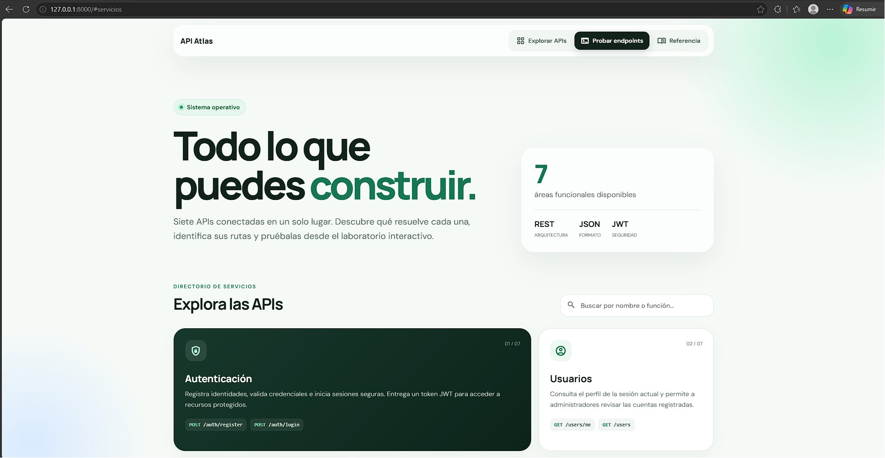
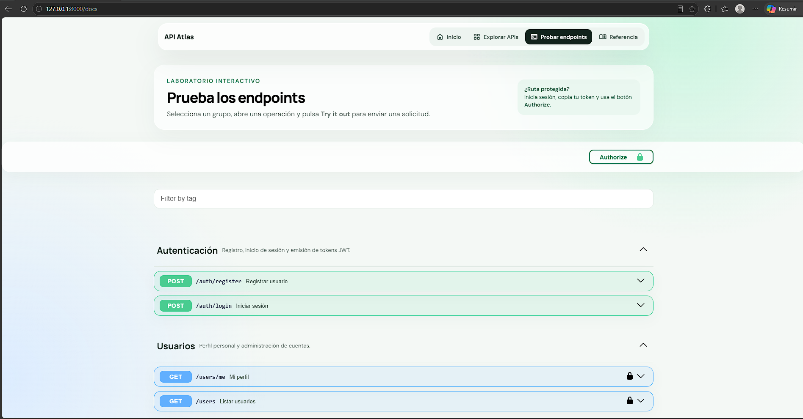
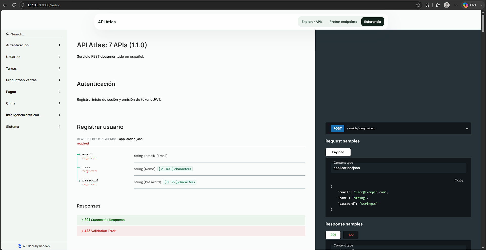

# Proyecto: Desarrollo de 7 APIs (Reto Profesional)

## Introducción
Este proyecto es un ejercicio práctico y académico diseñado para demostrar cómo se estructuran y construyen múltiples APIs dentro de un mismo ecosistema. El objetivo es emular un sistema real donde diferentes dominios de negocio interactúan entre sí bajo una arquitectura sólida, escalable y segura. 

A través de este proyecto, exploraremos desde la gestión de usuarios y autenticación, hasta el consumo de servicios externos como Inteligencia Artificial y datos del Clima.

---

## Navegación de las APIs (Qué son y por qué se usan)
El proyecto está dividido en 7 dominios o APIs diferentes, cada una con una responsabilidad única. Se estructuró de esta manera para mantener el código modular y fácil de mantener (similar a una arquitectura orientada a servicios).

1. **API de Usuarios:**
   - **Qué hace:** Permite consultar los perfiles de usuario y, para los administradores, listar todos los usuarios registrados en el sistema.
   - **Por qué:** Es el pilar del sistema. Sin usuarios, no hay a quién asignarle tareas o pedidos. Maneja los datos básicos de identidad.

2. **API de Tareas:**
   - **Qué hace:** Implementa un CRUD completo (Crear, Leer, Actualizar, Eliminar) de tareas.
   - **Por qué:** Demuestra cómo aislar datos. Un usuario solo puede ver y modificar las tareas que le pertenecen, garantizando la privacidad de la información.

3. **API de Productos y Ventas:**
   - **Qué hace:** Gestiona un catálogo completo (categorías, productos con precio y existencias) y permite realizar pedidos, descontando el stock automáticamente.
   - **Por qué:** Emula un e-commerce básico. Sirve para aprender sobre relaciones complejas en bases de datos (un pedido pertenece a un usuario y contiene un producto) y control de inventario.

4. **API de Autenticación:**
   - **Qué hace:** Maneja el registro de nuevos usuarios, el inicio de sesión (Login) y la emisión de Tokens JWT para mantener la sesión segura.
   - **Por qué:** Sin seguridad, cualquier persona podría borrar datos. Implementar contraseñas cifradas (hashes) y JWT es el estándar de la industria.

5. **API de Pagos:**
   - **Qué hace:** Registra intentos de cobro asociados a un pedido.
   - **Por qué:** En el mundo real, los pagos son críticos. Esta API demuestra cómo crear registros idempotentes (no cobrar dos veces) y prepararse para conectar un proveedor externo (como Stripe o PayPal).

6. **API de Clima:**
   - **Qué hace:** Consume un servicio externo (Open-Meteo) para devolver las condiciones climáticas basadas en coordenadas.
   - **Por qué:** Sirve para practicar cómo nuestro propio servidor puede hacer peticiones HTTP a terceros y entregar la información procesada a nuestros clientes.

7. **API de Inteligencia Artificial:**
   - **Qué hace:** Toma un texto (prompt) y utiliza la API de OpenAI para generar una respuesta.
   - **Por qué:** La integración con IA es una de las habilidades más demandadas. Muestra cómo manejar claves secretas de proveedores externos de forma segura.

---

## Arquitectura del Frontend (Interfaz de Usuario)
Para que las 7 APIs no sean solo código en una terminal, se requiere un **Frontend** (la parte visual de la aplicación web o móvil) que se conecte a estos servicios. Cada parte del sitio tiene un propósito específico:

1. **Diseño Visual para mostrar las APIs:**
   - **Por qué está ahí:** Una API (Backend) devuelve datos crudos en formato JSON. El diseño visual toma esos datos y los transforma en botones, tablas, imágenes y tarjetas atractivas para que cualquier persona, sin conocimientos técnicos, pueda interactuar con el sistema (comprar un producto, consultar el clima, etc.).

2. **Inicio (Landing Page o Home):**
   - **Por qué está ahí:** Es la puerta de entrada al proyecto. Su objetivo es explicar de qué trata la plataforma de manera rápida, enganchar al visitante y dirigirlo hacia las acciones principales (como registrarse o explorar el catálogo de productos).

3. **Panel de Privado (Dashboard / Login):**
   - **Por qué está ahí:** Una vez que el usuario inicia sesión (consumiendo la API de Autenticación), necesita un espacio seguro. Aquí es donde se conecta la API de Tareas (para que gestione sus pendientes) y la API de Pedidos (para ver su historial de compras).

4. **Catálogo e Interacción:**
   - **Por qué está ahí:** Es el núcleo del negocio. Muestra de forma amigable lo que devuelve la API de Ventas (inventario) y permite a los usuarios interactuar con la IA o consultar el clima en tiempo real desde una interfaz limpia.

5. **Referencias y Documentación:**
   - **Por qué está ahí:** Un proyecto profesional debe explicar cómo se construyó. Esta sección guía a otros desarrolladores hacia la documentación técnica (como Swagger) y da los créditos necesarios a las librerías, iconos y proveedores externos utilizados en el código.

---

## Capturas de Pantalla

### 1. Directorio de Servicios (Pantalla Principal)


### 2. Laboratorio Interactivo (Prueba de Endpoints)


### 3. Referencia Técnica de las APIs


---

## Requerimientos
Para poder ejecutar este proyecto en tu entorno local, necesitas tener instalado lo siguiente:
- **Python 3.10 o superior** (para ejecutar el servidor).
- **pip** (gestor de paquetes de Python).
- Un editor de código como **Visual Studio Code**.
- (Opcional pero recomendado) Git para control de versiones.

---

## Ejecución del Proyecto

### Opción 1: Ejecución estándar en PowerShell o Bash
Abre tu terminal (PowerShell en Windows o Bash en Linux/Mac) en la raíz del proyecto y ejecuta:

```powershell
# 1. Crear entorno virtual
python -m venv .venv

# 2. Activar entorno virtual
.\.venv\Scripts\Activate.ps1

# 3. Instalar dependencias
pip install -r requirements.txt

# 4. Copiar variables de entorno
Copy-Item .env.example .env

# 5. Levantar el servidor
uvicorn app.main:app --reload
```

### Opción 2: Alternativa si usas CMD (Símbolo del sistema de Windows)
Si la opción anterior te da errores como que "Copy-Item no se reconoce" o el entorno no se activa, es porque estás usando el **Símbolo del sistema (CMD)** clásico en lugar de PowerShell. En ese caso, usa estos comandos:

```cmd
# 1. Crear entorno virtual
python -m venv .venv

# 2. Activar entorno virtual en CMD
.venv\Scripts\activate

# 3. Instalar dependencias
pip install -r requirements.txt

# 4. Copiar variables de entorno (usando 'copy' en vez de 'Copy-Item')
copy .env.example .env

# 5. Levantar el servidor
uvicorn app.main:app --reload
```

> **Nota:** Una vez que el servidor esté corriendo, abre tu navegador web en `http://127.0.0.1:8000/docs` para ver e interactuar con la interfaz gráfica (Swagger UI).

---

## El Proceso Profesional para Desarrollar APIs
Desarrollar una API no es solo escribir código. Requiere una metodología estructurada:

### 1. Analizar el problema
Antes de escribir una sola línea de código, debes entender qué vas a construir.
- **1.1 ¿Qué datos necesita?** Definir las entidades (Usuarios, Tareas, Productos). Qué campos llevan (email, contraseña, precio, stock).
- **1.2 ¿Quién usa la API?** Determinar los roles. Por ejemplo, clientes móviles que consumen el catálogo, usuarios normales que ven sus propias tareas y administradores que agregan productos.

### 2. Diseñar
Planificar la estructura de la información y las interacciones.
- **2.1 Crear Endpoints:** Definir las rutas (URLs) y los verbos HTTP (`GET /users`, `POST /auth/login`, `DELETE /tasks/1`).
- **2.2 Diseñar la Base de Datos (BD):** Cómo se relacionarán las tablas (un usuario tiene muchas tareas, un pedido tiene un producto).
- **2.3 Definir Respuestas:** Establecer qué devolverá la API (JSON) y los códigos de estado HTTP (`200 OK`, `201 Created`, `404 Not Found`, `401 Unauthorized`).

### 3. Programar
La fase de implementación y codificación.
- **3.1 Crear el servidor:** Configurar el framework (FastAPI, Express, Django) y levantar el servicio en un puerto (ej. 8000).
- **3.2 Crear rutas:** Escribir el código que "escucha" las peticiones en los endpoints definidos en la fase de diseño.
- **3.3 Crear lógica de negocio:** Programar las reglas. Ej: "Si el producto no tiene stock, no permitir la venta", o "Hashear la contraseña antes de guardarla en la BD".

### 4. Probar
Asegurar que todo funcione correctamente y no haya fallos de seguridad.
- **4.1 Postman / Pruebas manuales:** Usar herramientas como Postman, Insomnia o Swagger UI para simular peticiones de clientes y validar que la API responda como se espera.
- **4.2 Pruebas automáticas:** Escribir código (ej. con `pytest`) que pruebe la API automáticamente cada vez que se hace un cambio en el código.

### 5. Documentar
Una API sin documentación no sirve, ya que nadie sabrá cómo usarla.
- **5.1 Swagger / OpenAPI:** Utilizar estándares de la industria para generar documentación interactiva que explique los parámetros requeridos y las respuestas esperadas. (FastAPI hace esto automáticamente).

### 6. Publicar
Llevar la API del entorno local a un entorno donde el mundo pueda usarla.
- **6.1 Servidor en la nube:** Desplegar el código en plataformas como AWS, Render, Heroku o Google Cloud usando bases de datos reales como PostgreSQL.
- **6.2 Seguridad:** Configurar HTTPS, ocultar variables de entorno (secretos de JWT o contraseñas de BD), proteger contra ataques (CORS, Rate Limiting).
- **6.3 Monitoreo:** Implementar herramientas para registrar (logs) si la API falla, medir tiempos de respuesta y recibir alertas si el servidor se cae.

---

## Conclusión
El desarrollo de APIs es una disciplina que combina arquitectura, seguridad y lógica de negocio. Este proyecto de "7 APIs" sirve como un excelente mapa de ruta para comprender cómo múltiples piezas de software se conectan para formar un producto digital completo. Dominar los pasos profesionales (Análisis, Diseño, Programación, Pruebas, Documentación y Publicación) es el puente entre escribir código como aficionado y desarrollar sistemas profesionales a nivel empresarial.
